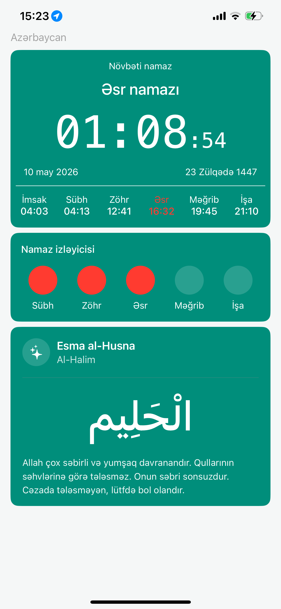
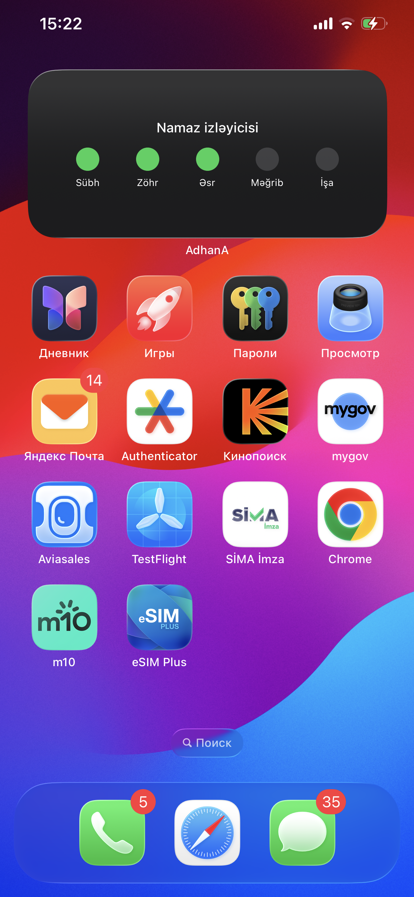

📱 AdhanA
A modern iOS application built with Swift / SwiftUI for displaying prayer times and Islamic content in a clean, minimal interface.
✨ Overview
AdhanA is a lightweight mobile app designed to help users:
View daily prayer times
Stay organized with religious schedule tracking
Use widgets for quick access
Experience a clean and calm UI focused on usability
🧠 Features
🕌 Daily prayer time calculation & display
📅 Structured timetable view
📱 Home screen widget support
🎨 Minimal and modern UI design
⚡ Fast and lightweight performance
🛠 Tech Stack
Swift
SwiftUI
WidgetKit
Xcode
iOS SDK
## 📸 Screenshots

### 🏠 Home Screen

### 📱 Widget

📦 Installation
Clone the repository:
git clone https://github.com/jabrayildev/AdhanA.git
Open in Xcode:
open AdhanA.xcodeproj
Run on simulator or device.
🚀 Project Purpose
This project was built as part of my iOS development portfolio to demonstrate:
UI/UX design skills in mobile applications
Working with SwiftUI layouts
Widget integration
Clean architecture practices
📌 Future Improvements
Dark mode optimization
Better localization (AZ / EN / AR)
API integration for accurate prayer times
Enhanced widget customization
Notifications for prayer alerts
👨‍💻 Author
Jabrayil Gulamzada
iOS / UI-UX Developer
⭐ If you like this project
Give it a star ⭐ and follow my work on GitHub.
